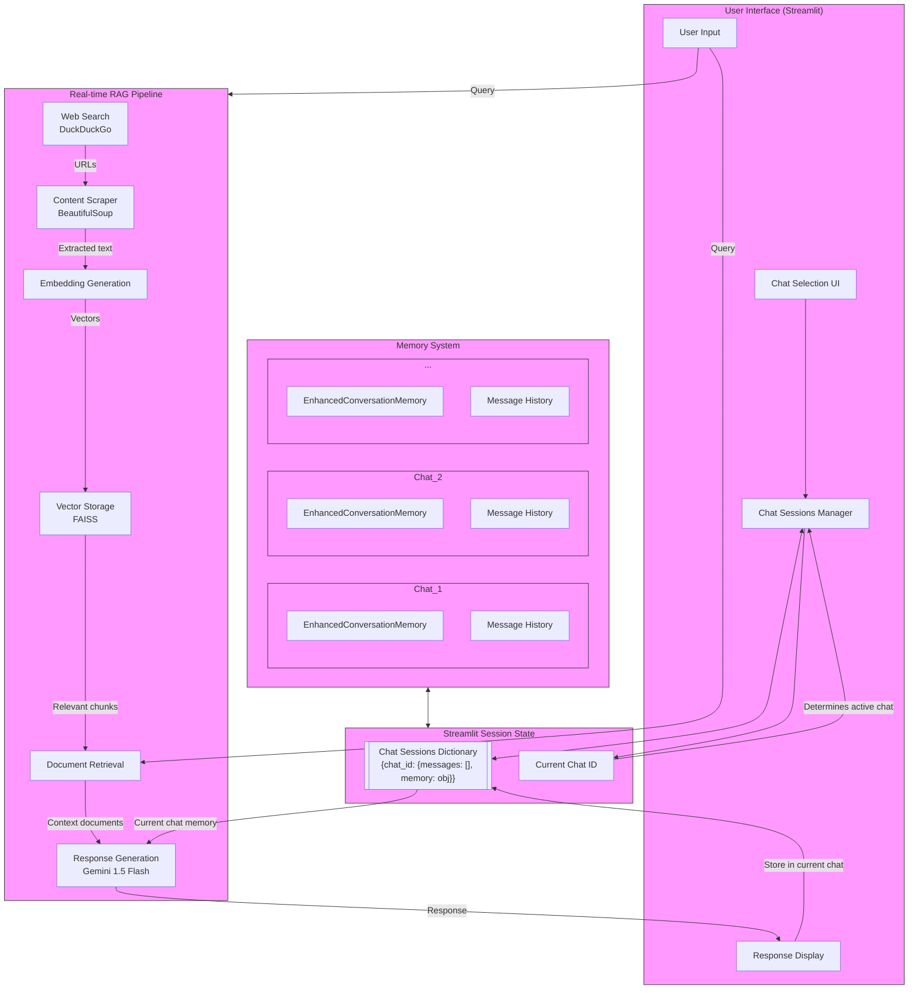

```mermaid
flowchart TD
    subgraph User_Interface["User Interface (Streamlit)"]
        UI_Input[User Input]
        UI_Output[Response Display]
        Chat_Manager[Chat Sessions Manager]
        Chat_Selector[Chat Selection UI]
    end

    subgraph Session_State["Streamlit Session State"]
        SS_Chats[["Chat Sessions Dictionary\n{chat_id: {messages: [], memory: obj}}"]]
        SS_Current[Current Chat ID]
    end

    subgraph RAG_Pipeline["Real-time RAG Pipeline"]
        Search[Web Search\nDuckDuckGo]
        Scraper[Content Scraper\nBeautifulSoup]
        Embedding[Embedding Generation]
        VectorDB[Vector Storage\nFAISS]
        Retrieval[Document Retrieval]
        Generation[Response Generation\nGemini 1.5 Flash]
    end

    subgraph Memory_System["Memory System"]
        subgraph Chat_1
            C1_Memory[EnhancedConversationMemory]
            C1_History[Message History]
        end
        subgraph Chat_2
            C2_Memory[EnhancedConversationMemory]
            C2_History[Message History]
        end
        subgraph Chat_N["..."]
            CN_Memory[EnhancedConversationMemory]
            CN_History[Message History]
        end
    end

    UI_Input --> |Query| RAG_Pipeline
    Chat_Selector --> Chat_Manager
    Chat_Manager <--> SS_Chats
    Chat_Manager --> SS_Current
    SS_Current --> |Determines active chat| Chat_Manager

    Search --> |URLs| Scraper
    Scraper --> |Extracted text| Embedding
    Embedding --> |Vectors| VectorDB
    VectorDB --> |Relevant chunks| Retrieval
    UI_Input --> |Query| Retrieval
    Retrieval --> |Context documents| Generation
    
    Memory_System <--> Session_State
    SS_Chats --> |Current chat memory| Generation
    Generation --> |Response| UI_Output
    UI_Output --> |Store in current chat| SS_Chats

    class User_Interface,Session_State,RAG_Pipeline,Memory_System,Chat_1,Chat_2,Chat_N purpleBox
    classDef purpleBox fill:#f9f,stroke:#333,stroke-width:1px

```
